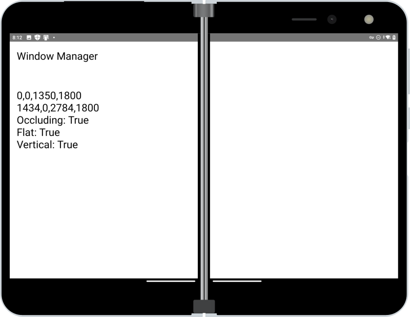

# Jetpack Window Manager for Uno Platfom

> **NOTE:** This is currently a work-in-progress (3-Sep-21)

Use [Xamarin.AndroidX.WindowJava](https://www.nuget.org/packages/Xamarin.AndroidX.Window.WindowJava) NuGet to test Jetpack Window Manager with Uno Platform Android apps.

