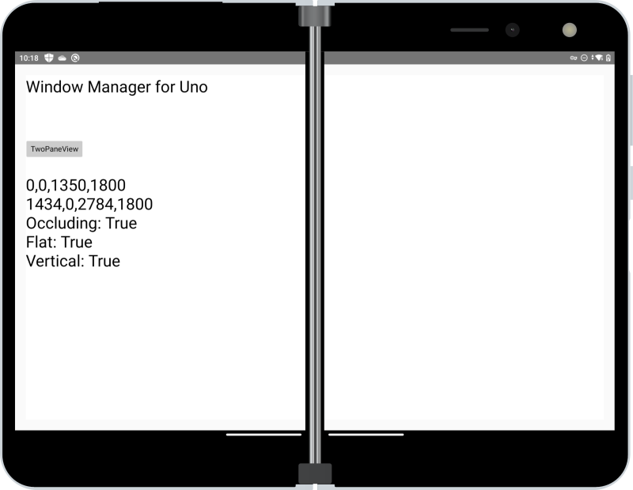
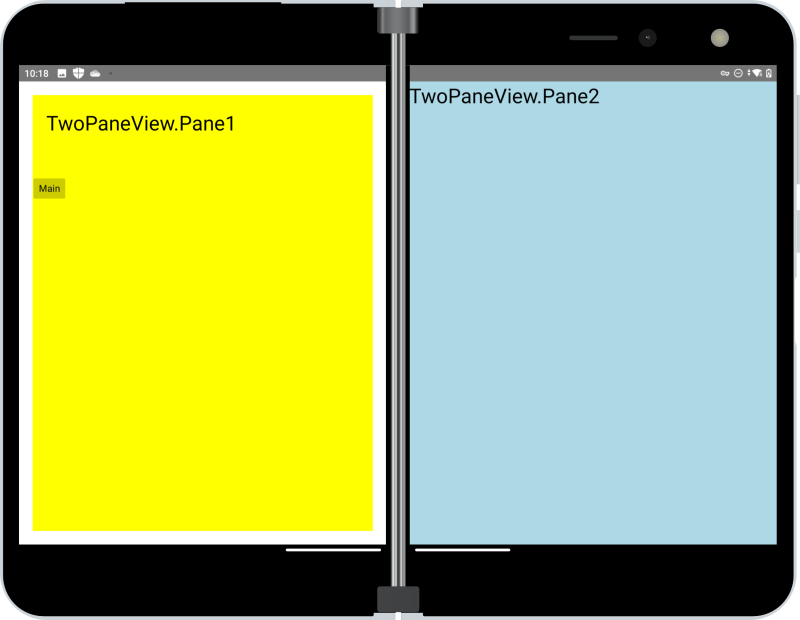

# Jetpack Window Manager for Uno Platfom

> **NOTE:** This is currently a work-in-progress (4-Sep-21). The implementation is tightly coupled to the Android MainActivity and ignores the event-based nature of Window Manager - to be resolved once the features are at least working from a measure/layout perspective.

Use [Xamarin.AndroidX.WindowJava](https://www.nuget.org/packages/Xamarin.AndroidX.Window.WindowJava) NuGet to test Jetpack Window Manager with Uno Platform Android apps.

Added a new interface `INativeFoldableProvider` to expose new data available from Window Manager's foldable feature class:

Replaced the implementation of `IApplicationViewSpanningRects` with one using Window Manager, and TwoPaneView seems to work^

_^ still some bugs to fix_

