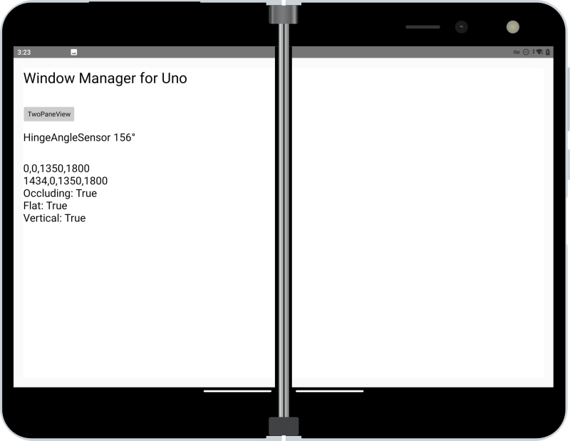
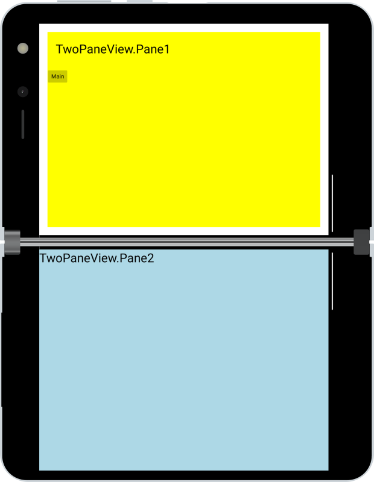
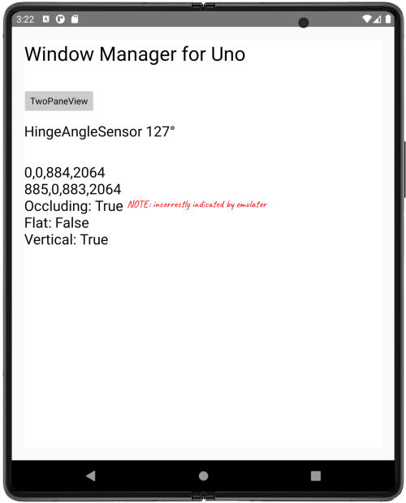

# Jetpack Window Manager for Uno Platfom

> **NOTE:** This is currently a work-in-progress (4-Sep-21). The implementation is tightly coupled to the Android MainActivity and ignores the event-based nature of Window Manager - to be resolved once the features are at least working from a measure/layout perspective.

Use [Xamarin.AndroidX.WindowJava](https://www.nuget.org/packages/Xamarin.AndroidX.Window.WindowJava) NuGet to test Jetpack Window Manager with Uno Platform Android apps.

- Added a new interface `INativeFoldableProvider` to expose new data available from Window Manager's foldable feature class via `FoldableApplicationViewSpanningRects` implementation (data shown on the main sample page).
- `FoldableApplicationViewSpanningRects` also implements existing interfaces `IApplicationViewSpanningRects` and `INativeDualScreenProvider`. The spanning rects get picked up by `TwoPaneView` which now works on other foldable devices.
- Re-implemented `INativeHingeAngleSensor` in `FoldableHingeAngleSensor` with more generic sensor identifier, so it now works on other foldable devices too.

## Surface Duo

Jetpack Window Manager `FoldingFeature` properties are surfaced and displayed, as well as the hinge angle:

Replaced the implementation of `IApplicationViewSpanningRects` with one using Window Manager, and TwoPaneView seems to work:

## Galaxy Fold 2

Jetpack Window Manager `FoldingFeature` properties are surfaced and displayed (note that the emulator incorrectly reports `IsOccluding` for this device type), as well as the hinge angle:

Replaced the implementation of `IApplicationViewSpanningRects` with one using Window Manager, and TwoPaneView seems to work. 

## Android-only

This is an Android-only sample for now... in general the code should run (as a no-op) on all the other platforms, and TwoPaneView should work fine, laying out according to its single-screen sizing rules.